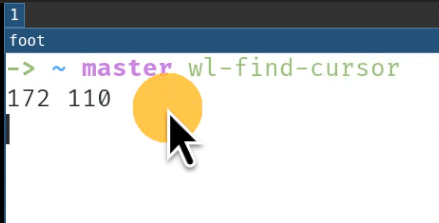

# wl-find-cursor

wl-find-cursor is a tool to highlight and print out global mouse position in wayland, especially for compositors based on wlroots, such as sway.

Due to security concerns, it's difficult to obtain the global mouse position in Wayland, that's to say, there is no `xeyes` for wayland.
This is generally not a problem. However, when we have multiple monitors and many editor windows open, 
it is sometimes necessary to quickly locate the mouse position.

This tool use layer-shell and virtual-pointer protocols to highlight and print out global mouse position in wayland. If the compositor lacks virtual pointer support, it can be worked around, but layer shell is essential.

**Since GNOME rejected to implement layer shell and virtual pointer protocol several years ago, it can not be supported by wl-find-cursor.**



# Build and Installation

Before building, you may need to install `wayland-devel` and `wayland-protocols-devel` pkgs first, it depends on the distribution you use.

```
git clone https://github.com/cjacker/wl-find-cursor
make
```

After built, install `wl-find-cursor` to `PATH` (local path or global path such as /usr/bin, /usr/local/bin).

# Usage

```
wl-find-cursor - highlight and report cursor position in wayland.

Options:
  -d <int>    : animation duration in milliseconds.
  -s <int>    : animation circle size.
  -c <hex int>: animation circle color in 0xAARRGGBB format.
  -p          : skip animation.
  -e <string> : command to emulate mouse move event.
  -h          : show this message.
```

Run `wl-find-cursor` directly, it will draw an animation (a growing circle) at the position of mouse cursor and exit. The duration is 1 second by default and the circle color is default to `0xcfd79921`. It should be enough to locate the mouse cursor. Moving mouse will quit the animation immediatly.

To obtain the mouse coordinates only:

```
wl-find-cursor -p
```

To customize the animation duration, circle size, circle color:

```
wl-find-cursor -c 0x88cc241d -s 400 -d 2000
```

It will show a semi-transparent red circle with size 400, the duration is 2000 milliseconds.

Usually you may bind it with a hot key such as `Super+m`, for example, for sway:

```
bindsym $mod+m exec wl-find-cursor
```

You can also use it with other tools to locate the cursor quickly such as grim and slurp:

```
wl-find-cursor && grim -g "$(slurp -d)"
```

### for KDE user

It seems kwin_wayland didn't implement virtual pointer protocol, but had layer shell support. I make a workaround for it, wl-find-cursor can accept a command to emulate mouse move event, for example, with 'ydotool':

```
wl-find-cursor -e "ydotool mousemove 0 1" -p
```

# Off topic: how to enlarge the cursor size

A large cursor will make things easier, usually I set cursor size to 64 in sway:

```
gsettings set org.gnome.desktop.interface cursor-size 64
swaymsg seat seat0 xcursor_theme "$(gsettings get org.gnome.desktop.interface cursor-theme)" 64
```

And append `Xcursor.size: 64` to `~/.Xresources`.

Above settings should work well with all common applications include wayland/X/gtk and qt.
